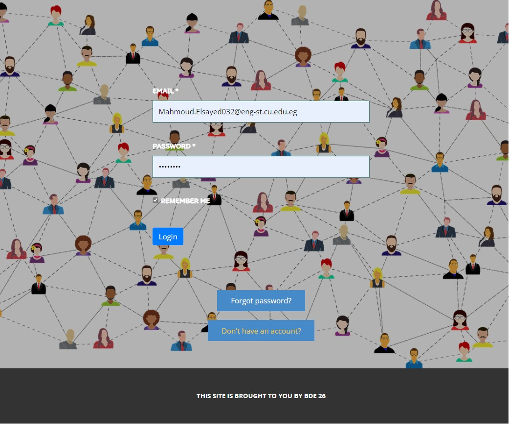
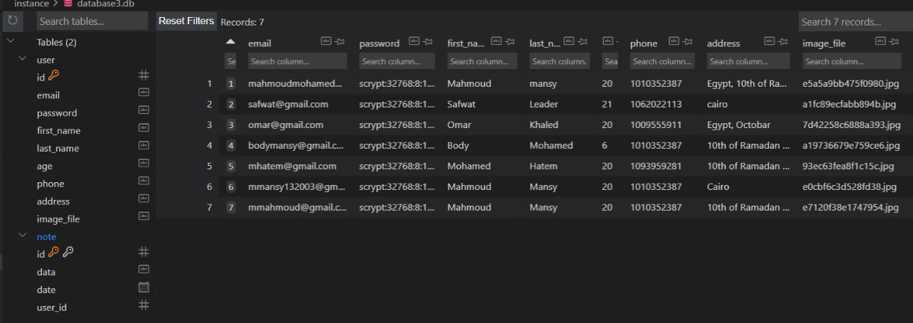
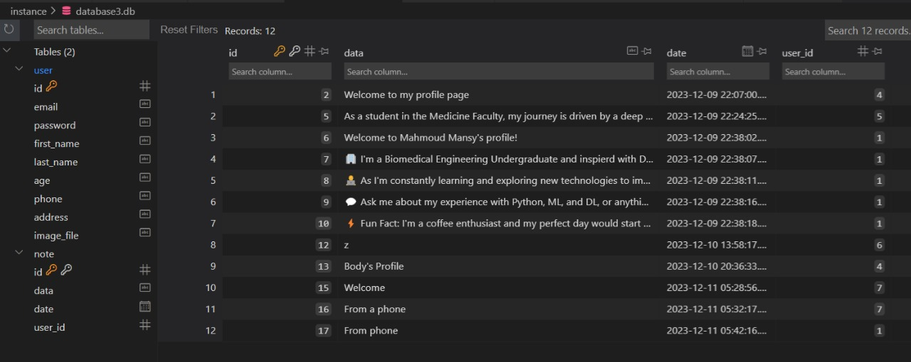
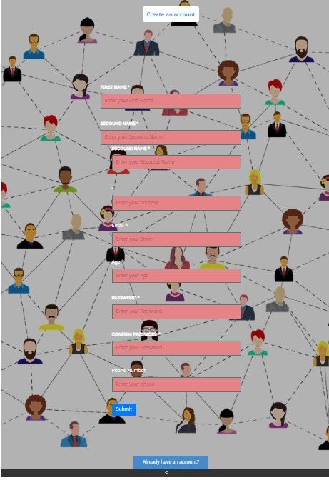

# Flask User Profile Management

## Discription
A comprehensive Flask web application showcasing user profile management features, including registration, login, profile editing, and image uploads. Implements user authentication, database integration, and dynamic rendering with Flask and Bootstrap. Ideal for learning Flask web development and best practices.

[a video presentation](https://drive.google.com/file/d/1hwISKuoGXkUZUnUkge7NuuITEzsCt7Sv/view)






<div style="text-align:center">
    
</div>

## Setup & Installation

Make sure you have the latest version of Python installed.

```bash
git clone <repo-url>
```

```bash
pip install -r requirements.txt
```

## Running The App

```bash
python main.py
```

## Viewing The App

Go to `http://127.0.0.1:5000`
